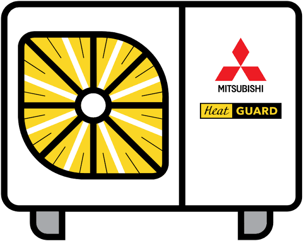

# IVIK HeatGuard RemoteGuard for Home Assistant



Unofficial cloud integration for IVIK HeatGuard heat pumps managed through RemoteGuard. Provides a thermostat and telemetry sensors, with optional control and support for Home Assistant's HomeKit Bridge. No browser or ESP32 is required during operation.

Requires Home Assistant 2026.9 or newer. Tested with Core 2026.9.4 and one HeatGuard installation. The parser currently expects the Ukrainian telemetry labels used by the tested portal. Other controller models and portal languages may need adaptation.

## Install with HACS

1. In HACS, open the menu → **Custom repositories**.
2. Add `https://github.com/4106677/ha-heatguard` with category **Integration**.
3. Download **IVIK HeatGuard RemoteGuard** and restart Home Assistant.
4. Add the integration under Settings → Devices & services. Enter your RemoteGuard email, password and device UID. Find the UID in the device settings form on the RemoteGuard account page (hidden field `uid`, visible through browser developer tools).
5. Keep control disabled until readings match the portal. Then enable it through the integration's Configure/options dialog.

This is a HACS custom repository; it has not been added to HACS's default catalog. Each user supplies their own account and device UID. Multiple devices can be configured separately.

## HomeKit

Add the built-in **HomeKit Bridge** integration and include the HeatGuard climate entity plus the temperature sensors you want. Pair that bridge in Apple Home while your phone can reach the bridge on the local network. The climate temperature is the controller's water temperature; do not assume it is room temperature.

## Version 0.2.0

Repeated power, mode or setpoint commands now refresh the settings and skip unchanged writes. The RemoteGuard “Нет данных какие нужно изменить!” response is accepted only if a fresh read confirms the requested settings. Ambiguous commands are never automatically retried.

## Подробности и ручная установка


Экспериментальная custom integration по результатам анализа авторизованной страницы RemoteGuard 30.09.2026. Она повторяет HTTP-запросы штатной панели, браузер для работы не требуется. Это облачное подключение.

## Проверено и что ещё проверить

В кабинете подтверждены названия полей, значения режимов, диапазоны слайдеров и JavaScript с маршрутами чтения/записи. Запись уставки через HA проверена: 39 → 40 → 39 °C при выключенном насосе. Значения подтверждены в кабинете RemoteGuard; включение насоса и переключение нагрев/охлаждение ещё не испытывались. Автоматический вход отдельной HTTP-сессии, получение показаний и загрузка в HA 2026.9.4 проверены на реальном сервере. Показания совпали с кабинетом RemoteGuard. Запись уставки подтверждена в RemoteGuard; применение на физическом контроллере отдельно не проверено. Локальные тесты проверяют разбор HTML, границы уставок и формирование команды через подставные ответы, без запуска HA.

Значение «Температура поточна» нельзя считать комнатной температурой без выяснения назначения датчика. Climate управляет уставкой контроллера: нагрев 25–55 °C, охлаждение 6–20 °C. В HomeKit это будет термостат с температурой контроллера, а не обязательно воздуха в комнате. Состояние компрессора не выводится из выбранного режима.

Показания ГВП −40 °C сохранены буквально; датчик отключён в реестре сущностей по умолчанию, поскольку причина значения неизвестна. Время устройства выведено в атрибут `device_time`; свежесть данных пока автоматически не оценивается. Успешное HTTP-чтение может вернуть старые облачные показания.

## Установка

1. Скопировать каталог `custom_components/heatguard` в `/config/custom_components/heatguard` на сервере Home Assistant.
2. Перезапустить HA.
3. Настройки → Устройства и службы → Добавить интеграцию → IVIK HeatGuard RemoteGuard.
4. Ввести email и пароль RemoteGuard и UID устройства из кабинета. Оставить `allow_control` выключенным при первой проверке.
5. Сравнить датчики и время с кабинетом. Если вход или разбор формы не работает, сохранить ошибку из журнала без пароля и cookie для дальнейшей доработки.
6. Для испытания управления открыть параметры интеграции и включить `allow_control`; повторно вводить пароль не требуется. Первая проверка — одна выбранная уставка, затем сверка в кабинете и на контроллере. Интеграция не включает насос при добавлении.

Учётные данные сохраняются стандартным механизмом config entry в хранилище HA. Они не включены в эти файлы.

## HomeKit

После проверки управления добавить штатный **HomeKit Bridge**, выбрать созданную сущность `climate` и нужные температурные датчики. Реальные entity_id посмотреть в HA; имена заранее не фиксируются. Счётчики энергии и все режимы расписания не обязательно представлены в Apple Home.

Документация: https://www.home-assistant.io/integrations/homekit/

## Известный протокол

- Авторизация: `GET /login`, затем `POST /login`, поля `email`, `password`, `redirect`.
- Страница состояния и актуальной формы: `GET /account`.
- Штатное обновление телеметрии каждые 60 секунд: `POST /index.php?route=account/account/refreshdevs`, поле `deviceCode`, ответ HTML. Прототип читает `/account` раз в 60 секунд для одновременного обновления настроек.
- Запись: `POST /index.php?route=account/account/setToDevice`, urlencoded полная форма, ответ JSON с `success` либо `error`.

| Поле | Значение |
|---|---|
| `uid` | Идентификатор устройства из формы |
| `id_59` | Включение: 1 / выключение: 0 |
| `id_60` | Нагрев: 1 / охлаждение: 0 |
| `id_61` | Уставка охлаждения 6–20 °C |
| `id_62` | Уставка нагрева 25–55 °C |
| `id_64` | Режим включения: день 0, ночь 1, расписание 2 |
| `id_65` | Режим ГВП: день 0, ночь 1, расписание 2 |
| `id_66` | Уставка ГВП 30–60 °C |
| `id_67` | Ночная уставка ГВП 30–60 °C |
| `id_83` | Сброс тревог: 1 / выключено: 0 |

Это идентификаторы веб-полей, **не доказанные адреса регистров Modbus**.

Перед записью клиент заново получает всю форму, сохраняет остальные уставки и режимы, принудительно устанавливает `id_83=0`. Сброс тревог, управление ГВП и расписаниями не выставлены наружу. При неоднозначном ответе запись автоматически не повторяется. Успех сервера означает подтверждение облака, а не доказанную доставку команды на насос. Параллельное изменение из веб-панели всё ещё может привести к гонке: условной записи или версии формы в найденном интерфейсе нет.

## Development

```sh
python3 -m unittest discover -s tests -v
python3 -m compileall -q custom_components
```

## License

Integration code is MIT licensed. The supplied product artwork and brand names remain the property of their respective owners.
